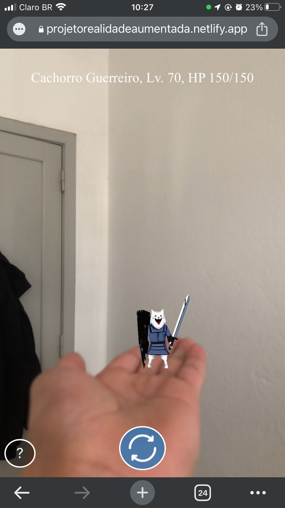

<h1 align="center">Animon GO</h1>

<h2 align="center">Introdução</h2>
O que é A-frame?
a-Frame é uma estrutura da web para criar experiências de realidade virtual (VR). A-Frame é baseado em HTML, tornando simples começar. Mas o A-Frame não é apenas um gráfico de cena 3D ou uma linguagem de marcação; o núcleo é uma poderosa estrutura de componente de entidade que fornece uma estrutura declarativa, extensível e combinável para three.js .

 https://aframe.io/docs/1.4.0/introduction/#what-is-a-frame

https://medium.com/chialab-open-source/build-your-location-based-augmented-reality-web-app-c2442e716564

Aframe-inspector: CTRL + ALT + I
https://github.com/aframevr/aframe-inspector

Manipulando seu modelo 3d
https://medium.com/@fabiojcortes/manipulate-your-3d-content-with-gestures-in-ar-js-78da4c076607

Ideias: 

- ler uma marca e mostrar os estabelecimentos locais
- Ler nota de compra de um determinado local e mostrar a imagem do local, com o link de codernada para abrir no google mapas
- ler cartas do yugioh
- ler carta do uno
- ler medicamento e mostrar a farmacia mais proxima ou entrar no site da farmacia
- escanear estabelecimento e mostrar dados sobre a empresa como: horarios de funcionamento, contato, agenda e sobre.
- ler determinado objeto e mostrar especificações tecnicas sobre ele e manual de instrução

- ler uma vaga de emprego e mostrar endereço, site e informações relacionada sobre ela

