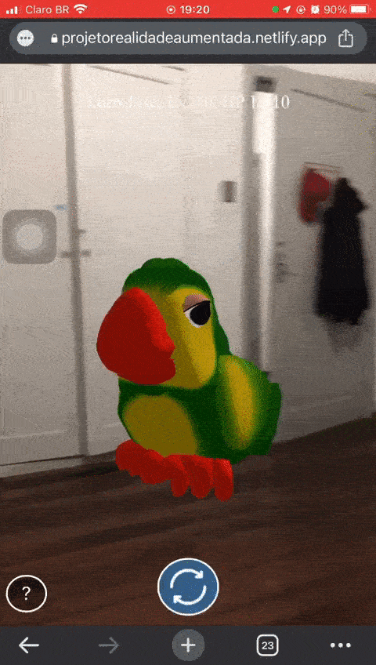

<h1 align="center">Animon GO</h1>

<h2>Introdução</h2>
O Animon Go foi desenvolvido com Realidade Aumentada, que é a integração de elementos virtuais em cenas do mundo real, em geral por meio de câmeras e sensores de movimento. Este recurso tem sido usado com frequência em aplicativos de redes sociais, com os filtros do Instagram e jogos como o Pokémon GO. A tecnologia também pode ser utilizada para fins educacionais e profissionais, em áreas como design de produtos, marketing e engenharia. Com ela, é possível visualizar objetos tridimensionais no mundo real, em geral a partir de telas, como as do celular, ou com óculos translúcidos de Realidade Aumentada. Ou seja, a realidade aumentada é uma experiência interativa do mundo real.
  

O Animon Go utiliza o recurso de <strong>Realidade Aumentada baseada em localização</strong>, esse tipo de AR usa lugares do mundo real (coordenadas de latitude e longitude de GPS) para mostrar conteúdo de Realidade Aumentada, no dispositivo do usuário. O usuário pode se mover (idealmente ao ar livre) e através de seus smartphones pode ver o conteúdo AR onde os lugares estão no mundo real. Mover-se e girar o telefone fará com que o conteúdo AR mude de acordo com a posição e rotação do usuário (portanto, os locais são 'ancorados' em sua posição real e parecem maiores/menores de acordo com a distância do usuário).

 
<h3>Pontos chave</h3>
<ul>
 <li><strong>Muito rápido:</strong> funciona com eficiência mesmo em telefones</li>
 <li><strong>Baseado na web:</strong> uma solução web pura, portanto não requer instalação. Totalmente baseado em javascript, usando three.js + A-Frame + jsartoolkit5</li>
 <li><strong>Compatibilidade:</strong></li> é cross-browser, funciona em todos os navegadores de telefone suportando webgl e webrtc (basicamente todos os telefones Android e iPhones acima do iOS 11)
 <li><strong>Suco de Brasil</strong></li> Animon utiliza modelos 3d de objetos e animais brasileiros
</ul>
  
<h3>Status do Projeto</h3>
Atualmente as coordenadas de latitude e longitude estão estáticas, ou seja, estão fixas em somente um local (é temporário). Logo, só será possivel visualizar os modelos 3D caso o usúario esteja próximo a essas cordenadas utlizadas no projeto.
  
<h3>Próximo passo</h3>
Implementarei uma <a href="https://location.foursquare.com/docs/">API externa</a> que basicamente utilizará o recurso de localização do disposito para capturar a latitude e longitude e então irá atualizar as coordenadas de geolocalização que estão estáticas, permitindo então que o usuario consiga visualizar os modelos 3D indenpendente de onde esteja no mundo.
